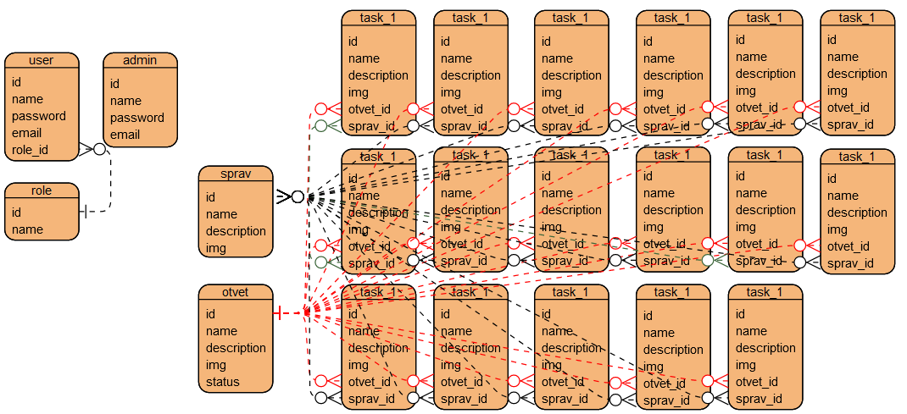

// Основная концепция \\

Сайт должен работать следущим образом. Новый пользователь заходит и регистрируется вводя
имя, пароль и электронную почту. При входе он попадает на главную страницу где он может
выбрать блок с задание. Блок - список задач на одну тематику. Далее у него есть выбор
просмотреть существующие задачи, сформировать рандомный вариант из существующих задач,
сформировать вариант самостоятельно (он будет просматривать задачи как говорилось ранее).

===========================================================================================

// Функции сайта \\

Просматривать блоки задач. Каждый блок это отдельный раздел (можно реализвать как
категории в курсовой работе Лёши)

Просматривать конкретную задачу и решение к ней. Это страница состоит из названия/заголовка
задачи, самой задачи ввиде текста с возможным графическим представлением, кнопкой справки и
кнопки просмотра ответ, который будет выглядеть аналогично.

Просматривать справочник с материалами. Материалы - формулы, теоремы, правила и т.д.

Сформировать варианты из рандомных/самостоятельно выбранных задач. Процесс рандомной
генерации варианта следующий, из каждого блока берётся по одной задаче и выводится на
странице. При ручном наборе задач пользователь просто скитается по сайту и отмечает
интересующие его задачи, как избранные.

Возможность выгрузки выбранной задачи/сформированного варианта. Эта функция позволит сохранить сгенерированный любым способом вариант в документе (ворд и/или пдф).

===========================================================================================

// Роли пользователей сайта \\

Администратор БД - он вносит новую информацию в БД

Администратор Преподаватель (модератор) - он получает на почту или в ЛС запрос от
пользователей на размещение новой задачи (задачу предлогает пользователь, админ.п. ее
рассматривает и принимает/отклоняет заявку на размещение)

Преподаватель - может просматривать сайт в поисках задач, а так же пользоваться функциями
сайта и предлогать модератору свои задачи для публикации.

Студент - может просматривать сайт в поисках задач, а так же пользоваться функциями
сайта.

===========================================================================================

// Описание ER-диаграммы \\

таблица role содержит список с названием ролей (в таблице будет заполняться поле name -
название роли).

таблица user содержит информацию о пользователях (в таблице будет заполняться имя пользователя (name), данные для входа/регистрации (password и email) и роль).

таблица admin содержит список администраторов аналогичный пользователям.

таблица sprav содержит в себе справочные материалы, теоремы, формулы и т.д. (таблица будет
заполняться так: вводиться название/заголовок справки (name), вводиться сама справка
(description) и
если нужно можно добавить картинку (img)).

таблица otvet содержит решение для задачи (заполняется так: вводится название ответа/заголовок (name), само решение вводится в description, по необходимости загрузить
рисунок/картинку (img) и поле статус будет булевым (логическим) значением (является фичей
для искуственного ограничения в доступе, то есть можно будет заприватить решение задачи,
что бы его никто не мог просмотреть кроме автора этого ответа и администратора).

таблица task_1 является блоком задач, то есть в одной такой таблице содержится сразу
несколько задач на одну и тужу тему (заполнение следующее: название/заголовок задачи (name),
сама задача (description), добавление изображения если надо (img), ссылка на решение
(otvet_id), ссылка на справочные материалы, которые могут помочь для решения задачи
(sprav_id)).

===========================================================================================

// Навигация по ER-диаграмме \\

17 таблиц с названием task_1 должны быть расписаны как task_1, task_2, task_3,...
Но из-за тормознутого конструктора ER-диаграм не получилось сделать различные названия,
поэтому придется представить что названия таблиц task_1 различа.тся)

Связь таблицы user с таблицей role один ко многим.

Связь таблицы sprav с таблицами task_(1 - 17) многие ко многим (обозначены черными
дорожками).

Связь таблицы otvet с таблицами task_(1 - 17) один ко многим (но лучше сделать могие к
одному, это из-за того что к одной задаче может быть несколько решений)(обозначены красными
дорожками).

===========================================================================================

// Нюансы \\

Текст в условии задачи может быть больше чем может поместиться в БД.

Спец символы не поддерживаются MySQL из-за чего нужно будет менять кодировку.

Для удобного ввода спецсимволов нужно добавить виргуатьную клавиатуру.

Не известно, то как будет работать приватный ответ, как определить кому он будет виден, а
кому нет.
